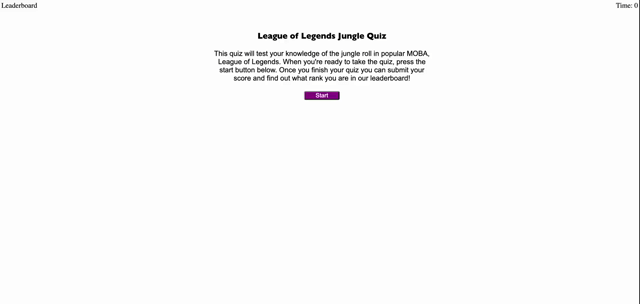

# code-quiz

## Description
I made this mini-quiz to showcase my skills in Javascript, and satisfy one of my bootcamps homework requirements. No starter code was provided for this project. The question cards are saved as a class of box. Question boxes can be edited, added, or removed, and the Javascript will work to cycle through all questions and displays correctly. On page load the javascript collects every element with class box as a variable called boxEl. On quiz start, the index of each of these elements is added to an array, which allows the quiz function to index within the boxEl variable, and update the css display property to switch between question displays. The time remaing upon quiz completion is saved to local storage, including the users initials. Theses "scores" are then appended as li's to the leaderboard ordered list. Only local storage has been used, as that is what we have learned at this point! Should you like to play with your friends and see who can get the best time, try it out!!

Link to deployed website:

## Tutorial
Interactions:
1. The "Start" button will start the timer in the top right (you have 100 seconds to finish 5 questions).
2. The"Leaderboard" in the upper left hand corner will take you directly to the leaderboard display (if you haven't played yet, there will be no scores).
3. Clicking on any of the possible answers (1-4) within each question, will take you to the next question (answer feedback for the previous question will be displayed at the bottom of your current question).
4. The "Submit" button at the end will save your initials with your score, and display the leaderboard. 
5. On leaderboard display, you can clear the leaderboard with "Clear History", or reload the quiz with "Go Back"

